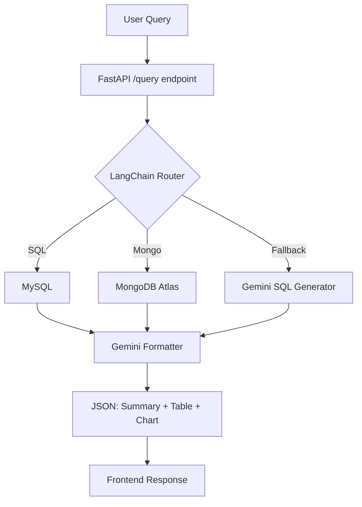

# 💼 Wealth Assistant — Natural Language Financial Data Query System

## 🚀 Overview

Wealth Assistant is an AI-powered, full-stack platform that allows users to ask natural language questions over multiple databases (MySQL & MongoDB) and receive structured financial insights with summaries, tables, and graphs.

Designed for **relationship managers handling high-net-worth individuals** (film stars, athletes, etc.), it turns complex, scattered financial data into easy-to-understand visual stories.

---

## 🧠 Core Technologies

| Layer       | Tech Stack                                    |
| ----------- | --------------------------------------------- |
| Frontend    | React.js, Recharts                            |
| Backend     | FastAPI (Python), LangChain, LangGraph        |
| LLM + RAG   | Gemini 1.5 Flash, LangChain                   |
| Databases   | MySQL, MongoDB Atlas                          |
| Graph API   | QuickChart.io                                 |
| Storage     | LocalStorage (for frontend history)           |
| Voice Input | Web Speech API                                |

---

## 🌐 Live Features (User-Visible)

### 🔍 Natural Language Query (NLQ)

Users can ask:

* “Top 5 clients by portfolio value”
* “Which clients hold Infosys stock?”
* “Who manages the highest portfolio?”

✨ Gemini generates:

* A financial **summary**
* A structured **table**
* A relevant **graph** (bar, pie, line, etc.)

---

### 📊 Insights Dashboard

Navigate to `/insights` to view:

* 🔹 **3 Historical Charts** (from LocalStorage recently added data): Top clients & stocks
* 🔸 **3 LLM-based Charts** (from AI-generated insights)

---

### 🗣️ Voice Search

Press the mic icon and speak your query.

* Converts voice to text
* Sends to the backend just like typed input

---

### 📚 Query History

Visit `/history`:

* Stores local query + response (summary + table + graph)
* Fully frontend-driven using LocalStorage
* Clicking opens a modal to review past results

---

## 🧱 Backend Architecture



### Key Endpoints

* `POST /query`
  Handles natural language input → routes to DB → formats → returns insights

* `GET /insights`
  Returns:

  * 3 LocalStored recently search query data
  * 3 Gemini-generated charts based on business logic

---


## 🧩 LangChain Usage

* **LangChain** decides routing: SQL vs Mongo vs fallback
* **LangChain** components:

  * Custom chains for SQL generation & formatting
  * Agent for fallback logic

---

## 📁 File Structure

```bash
Wealth-Assistant/
├── backend/
│   ├── main.py
│   ├── chains/
│   │   ├── query_router.py
│   │   ├── sql_generator.py
│   │   ├── response_formatter.py
|   |   ├── mysql_query.py
|   |   ├── mongo_query.py
│   ├── db/
│   │   ├── mysql_handler.py
│   │   └── mongo_handler.py
│   └── utils/
│       ├── sql_runner.py
│
├── frontend/
│   ├── components/
│   │   ├── Navbar.jsx
│   │   ├── Layout.jsx
│   │   ├── HistoryModal.jsx
│   │   ├── QueryForm.jsx
│   │   ├── ResultCard.jsx
│   ├── pages/
│   │   ├── Home.jsx
│   │   ├── History.jsx
│   │   └── Insights.jsx
│   └── App.jsx
│   └── api.js
│
├── .env
├── README.md
```

---

## 🧪 Sample Queries

```bash
Q: "Top 5 clients by portfolio value"

Q: "Which clients are managed by Ashima?"

Q: "Explain what SIP means"

```

---

## 🏦 Database Setup

### 🧮 MySQL

```sql
CREATE DATABASE portfolio_db;
USE portfolio_db;

CREATE TABLE transactions (
  id INT AUTO_INCREMENT PRIMARY KEY,
  client_id VARCHAR(100),
  stock_name VARCHAR(100),
  value DECIMAL(12,2),
  date DATE
);

CREATE TABLE relationship_managers (
  client_id VARCHAR(100),
  manager_name VARCHAR(100),
  PRIMARY KEY(client_id)
);
```

### 🍃 MongoDB

* Example document:

```json
{
  "client_id": "C001",
  "name": "John Doe",
  "address": "Mumbai",
  "risk_appetite": "High",
  "investment_preferences": ["Equity", "Crypto"]
}
```
run the data.py file to directly import sample_data into your DB.

---

## 🚀 Getting Started

### 1️⃣ Backend Setup

```bash
cd backend
Create virtual environment if required!
python -m venv venv
In Command Prompt:
venv\Scripts\activate
In PowerShell (if Command Prompt fails):
.\venv\Scripts\Activate.ps1

pip install -r requirements.txt

# Create .env file with:
# GOOGLE_API_KEY=
MYSQL_HOST=localhost
MYSQL_USER=root
MYSQL_PASSWORD=
MYSQL_DB=portfolio_db
MONGO_URI=YOUR_MONGO_URI


python main.py
```

### 2️⃣ Frontend Setup

```bash
cd frontend
npm install
npm run dev
```

---

## 💡 Future Enhancements

| Feature                   | Description                                               |
| ------------------------- | --------------------------------------------------------- |
| ✨ Model Context Protocol  | Use LangChain's MCP to support persistent multi-turn chat |
| 🔐 Auth & Role Access     | Secure dashboard by user types (client, manager)          |
| 📈 Real-time Market Data  | Integrate with stock APIs for live portfolio updates      |
| 📄 PDF Upload + Parsing   | Extract and ingest documents for context in RAG           |
| 📤 Export Insights        | Save insights as PDF or CSV                               |
| 📱 Mobile App Integration | Build companion app using React Native                    |

---

## 🙋 Why This Project Stands Out

* ✅ Gemini + LangChain 
* ✅ SQL & NoSQL support with intelligent routing
* ✅ RAG-enhanced LLM responses
* ✅ AI-generated chart suggestions
* ✅ Modern UI with historical memory

---

## 📬 Contact

Feel free to reach out if you want to collaborate, extend this project, or hire me for an AI-driven initiative.

**Built with ❤️ by \Utkarsh Pratap Singh**

---

Would you like this also exported as a `README.md` file or added to your GitHub template with badges and deployment links?
